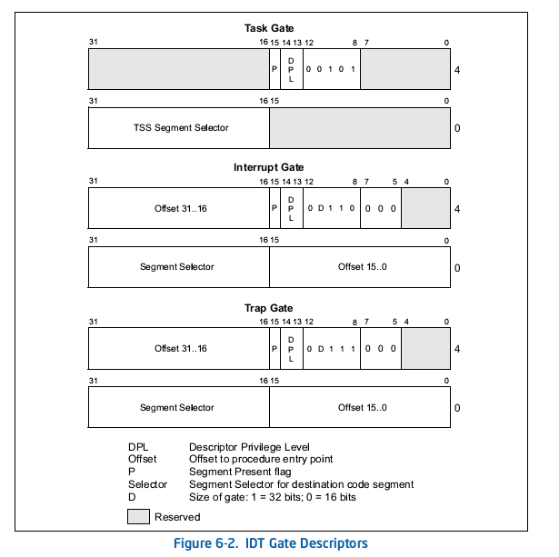

# 中断与异常

## 简述

中断引入的目的：

- CPU 需要与外设进行交流。
- 因为 CPU 与外设存在显著的速度差异，如果使用轮询的方式则太浪费 CPU 资源了。
- 引入中断机制解决了上面两个问题，但是导致操作系统的理解更加困难。

在操作系统中，有三种特殊的中断事件：

- 由 CPU 外部设备引起的外部事件，简称**中断 (interrupt)**
  - 比如：IO 中断、时钟中断、控制台中断。
  - 因为它的产生与 CPU 的执行无关，我们也称它为异步中断。
- 把在 CPU 执行指令期间检测到不正常或非法的条件所引起的内部事件称作**异常 (exception)**
  - 比如：除零错误、地址访问越界。
  - 这类 CPU 内部事件导致的称谓同步中断，也称哪部中断
- 在程序中使用请求系统服务而引发，称作**陷入中断 (trap interrupt)**、也称软中断、系统调用。

处理中断的的流程大致如下：

1. CPU 收到中断 (8259A) 或者异常的事件时，它会暂定执行当前的程序或任务；
2. CPU 通过 IDT（Interrupt Descriptor Table，存储着中断向量与中断服务例程的对应关系）查询处理中断的例程，IDT 是中断处理的核心结构；
3. 执行例程完成后跳回被打断的程序。

## 中断描述符表 IDT

IDT 中的中断描述符可以分为三种：

- Task Gate、Interrupt Gate、Trap Gate

下面是这三种中断描述符的结构：

实验中使用到的是后两种结构，他们的实现有着一点微小的区别：

- CPU 跳转到 Interrupt Gate 里的地址时，在将 `EFLAGS` 保存到栈上之后，清除 `EFLAGS` 里的 `IF` 位，以避免重复触发中断。
- 用户进程在正常执行中是不能禁止中断的，也就是说 Trap Gate 不会清除 IF 位。