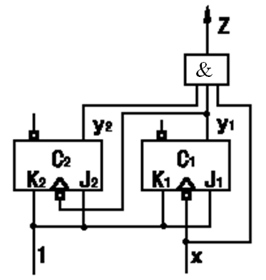
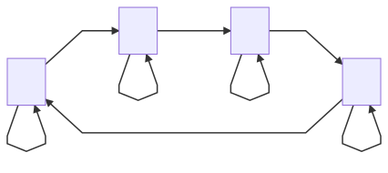

> 学习途径：
>
> - 欧阳星明、华中科技大学出版社 《数字逻辑》

# 异步时序逻辑电路

## 脉冲异步时序逻辑电路分析

分析步骤如下：

1. 写出电路的输出函数和激励函数表达式
2. 列出电路的次态真值表或次态方程组
3. 作出状态表和状态图
4. 画出时间图并用文字描述电路的逻辑功能

例子：

> 分析下图所示的脉冲异步时序逻辑电路，指出该电路的主要功能：
>
> 

STEP 1：写出输出函数和激励函数表达式：

- 输出函数：$$Z = x \cdot y_2 \cdot y_1$$
- JK1 激励函数：$$J_1=K_1=1, C_1 = x$$
- JK2 激励函数：$$J_2=K_2=1, C_2 = y_1$$

STEP 2：列出电路的次态真值表或次态方程组：

由 STEP 1 中的分析可知，两个 JK 触发器均工作在计数状态，即恒有：$$Q^{n+1} = \overline{Q^n}$$。所以次态真值表（x=1）：

| 现态    | 现态    | 次态          | 次态          |
| ------- | ------- | ------------- | ------------- |
| $$y_2$$ | $$y_1$$ | $$y_2^{n+1}$$ | $$y_1^{n+1}$$ |
| 0       | 0       | 0             | 1             |
| 0       | 1       | 1             | 0             |
| 1       | 0       | 1             | 1             |
| 1       | 1       | 0             | 0             |

STEP 3：做出状态表和状态图：

（状态表略）状态图：

STEP 4：画出时间图并用文字描述电路的逻辑功能

（时间图略）

由上知，该电路是一个模 4 加 1 计数器，当收到第四个输入脉冲时，电路产生一个进位输出脉冲。

## 脉冲异步时序逻辑电路设计

脉冲异步时序逻辑电路设计的一般过程与同步时序逻辑电路设计大体相同。

在脉冲异步时序逻辑电路设计时，主要注意以下两点：

1. 若有多个输入信号，在形成原始状态图和状态表时，只需要考虑多个输入信号中的一个为 1 的情况，从而使问题简化。
2. 由于电路中没有统一的时钟脉冲，钟控触发器的时钟信号同样需要求激励函数。

## 电平异步时序逻辑电路设计

不就是组合逻辑电路？