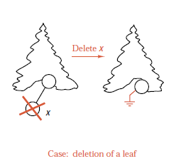
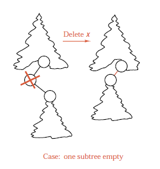
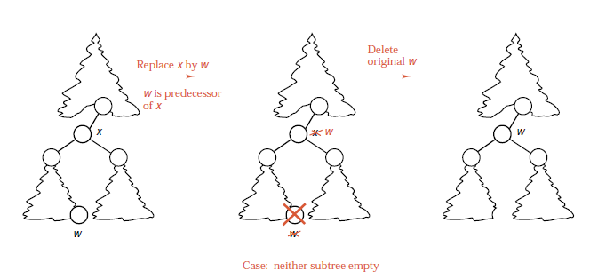

# Chapter 10--Binary Trees

## Binary Trees

### Definitions

**Binary Tree**: 

> A binary tree is either empty, or it consists of a node called the root together with two binary trees called the left subtree and the right subtree of the root.

1. Empty Tree: The first case, the base case that involves no recursion, is that of an empty binary tree.  **The empty tree will usually be the base case for recursive algorithms and will determine when the algorithm stops.**
2. One node tree: The only way to construct a binary tree with one node is to make that node into the root and to make both the left and right subtrees empty. Thus **a single node with no branches is the one and only binary tree with one node.**
3. Tree node tree: With two nodes in the tree, **one of them will be the root and the other will be in a subtree**.

### Traversal

If we name the tasks of visiting a node V, traversing the left subtree L, and traversing the right subtree R, then there are six ways to arrange them:

#### standard traversal orders

1. `VLR` &rarr; preorder
2. `LVR` &rarr; inorder(symmetric oder)
3. `LRV` &rarr; postorder (endorder)

#### Expression Trees

> An expression tree is built up from the simple operands and operators of an (arithmetical or logical) expression by placing the simple operands as the leaves of a binary tree and the operators as the interior nodes. 

1. For each binary operator, the left subtree contains all the simple operands and operators in the left operand of the given operator, and the right subtree contains everything in the right operand.

2. For a unary operator, one of the two subtrees will be empty. 

The names of the traversal methods are related to the **Polish forms** of the expressions: 

1. preorder traversal yields the prefix form, in which every operator is written before its operand(s); 
2. inorder traversal gives the infix form (the customary way to write the expression); 
3. postorder traversal gives the postfix form, in which all operators appear after their operand(s). 

### Linked Implementation

#### Basic method

1. empty constructor &rarr; set root pointer as `NULL`. (check empty).
2. visit a node.
3. Recursive traversal.

## Binary search trees

### Defination

> A binary search tree is a binary tree that is either empty or in which every node has a key (within its data entry) and satisfies the following conditions:
> 1. The key of the root (if it exists) is **greater than** the key in any node in the left subtree of the root.
> 2. The key of the root (if it exists) is **less than** the key in any node in the right subtree of the root.
> 3. The left and right subtrees of the root are again binary search trees.

### Tree Search

Strategy:

- To search for the target, we first compare it with the entry at the root of the tree. If their keys match, then we are finished. Otherwise, we go to the left subtree or right subtree as appropriate and repeat the search in that subtree.

### Insertion

### Treesort

#### defination

> We simply take the entries to be sorted, use the method insert to build them into a **binary search tree**, and use inorder traversal to put them out in order.

#### comparison with quick-sort

Treesort makes exactly the same comparisons of keys as does quicksort when the pivot for each sublist is chosen to be the first key in the sublist.

### Removal

1. case 1: deletion of a leaf.

   

2. case 2: one subtree empty.

   

3. case 3: none subtree empty.

   

## Building a binary search tree