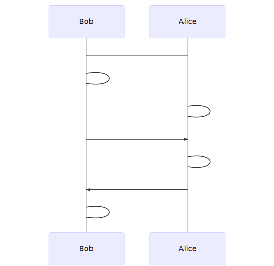

# Week Two

## Chapter 1. Introduction

Terminologies in this Class: **Confidentiality, Integrity, Authenticity** etc.

### Diffie-Hellman key exchange

用于在两个终端之间共享一个私密的数字：

此时两个终端直接就共享了一个私密信息：$$\displaystyle g^{X_A X_B}\pmod{p}$$

### public-key crypto-systems

The keys for the RSA algorithm are generated the following way:

1. Choose two distinct prime numbers `p` and `q`
   - For security purposes, the integers `p` and `q` should be chosen at random, and should be similar in magnitude but differ in length by a few digits to make factoring harder.[[2\]](https://en.wikipedia.org/wiki/RSA_(cryptosystem)#cite_note-rsa-2) Prime integers can be efficiently found using a [primality test](https://en.wikipedia.org/wiki/Primality_test).
2. Compute `n = pq`
   - *n* is used as the [modulus](https://en.wikipedia.org/wiki/Modular_arithmetic) for both the public and private keys. Its length, usually expressed in bits, is the [key length](https://en.wikipedia.org/wiki/Key_length).
3. Compute $$\phi(n) = lcm(\phi(p), \phi(q)) = lcm(p − 1, q − 1)$$, where $$\phi$$ is [Carmichael's totient function](https://en.wikipedia.org/wiki/Carmichael%27s_totient_function). This value is kept private.
4. Choose an integer *e* such that 1 < *e* < *λ*(*n*) and [gcd](https://en.wikipedia.org/wiki/Greatest_common_divisor)(*e*, *λ*(*n*)) = 1; i.e., *e* and *λ*(*n*) are [coprime](https://en.wikipedia.org/wiki/Coprime).
5. Determine *d* as *d* ≡ *e*−1 (mod *λ*(*n*)); i.e., *d* is the [modular multiplicative inverse](https://en.wikipedia.org/wiki/Modular_multiplicative_inverse) of *e* modulo *λ*(*n*).

