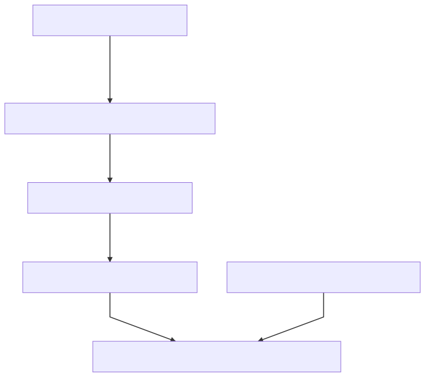
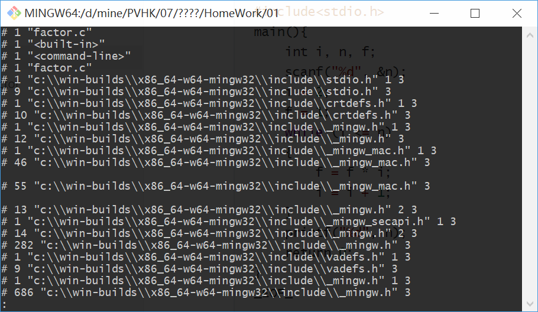

<style>.img{width: 100%}</style>

> 参考网址：
>
> - http://www.ntu.edu.sg/home/ehchua/programming/cpp/gcc_make.html
> - https://linux.die.net/man/1/gcc
> - https://sourceware.org/ml/binutils/2009-08/msg00193.html
> - https://web.stanford.edu/class/cs193d/handouts/make.pdf

# 编译器的工作

## 编译器的主要流程

一个现代编译器的主要流程如下：（以 `gcc` 为例）




另外，使用以下命令可以查看 `gcc` 使用的所有命令：

```bash
$ gcc -v example.c
```

该命令的输出会打印在 `stderr` 上，若希望在文件中阅读该信息，可以使用以下命令：

```bash
$ gcc -v example.c 2> verbose_gcc.txt
```

## 预处理器的工作

从[维基百科](https://zh.wikipedia.org/wiki/%E9%A2%84%E5%A4%84%E7%90%86%E5%99%A8)上的定义：**预处理器**是程序中处理输入数据，产生能用来输入到其他程序的数据的程序。输出被称为输入数据**预处理过**的形式，常用在之后的程序比如编译器中。C 预处理器是最常见的预处理器。

### C 预处理器

**C 预处理器**不是编译器的组成部分，但是它是编译过程中一个单独的步骤。简言之，C 预处理器只不过是一个文本替换工具而已，它们会指示编译器在实际编译之前完成所需的预处理。

所有的预处理器命令都是以井号（#）开头。它必须是第一个非空字符，为了增强可读性，预处理器指令应从第一列开始。像我们常用的 **define**，**include** 等都是 C 预处理器的预处理指令。

### 预定义宏

ANSI C 定义了许多宏。在编程中您可以使用这些宏，但是不能直接修改这些预定义的宏。

| 宏         | 描述                                                  |
| ---------- | ----------------------------------------------------- |
| `__DATE__` | 当前日期，一个以 `"MMM DD YYYY"` 格式表示的字符常量。 |
| `__TIME__` | 当前时间，一个以 `"HH:MM:SS"` 格式表示的字符常量。    |
| `__FILE__` | 这会包含当前文件名，一个字符串常量。                  |
| `__LINE__` | 这会包含当前行号，一个十进制常量。                    |
| `__STDC__` | 当编译器以 ANSI 标准编译时，则定义为 1。              |

### 预处理器运算符

| 运算符                    | 作用                                                         |
| ------------------------- | ------------------------------------------------------------ |
| 宏延续运算符（`\`）       | 一个宏通常写在一个单行上。但是如果宏太长，一个单行容纳不下，则使用宏延续运算符（\）。 |
| 字符串常量化运算符（`#`） | 在宏定义中，当需要把一个宏的参数转换为字符串常量时，则使用字符串常量化运算符（#）。在宏中使用的该运算符有一个特定的参数或参数列表。 |
| 标记粘贴运算符（`##`）    | 宏定义内的标记粘贴运算符（##）会合并两个参数。它允许在宏定义中两个独立的标记被合并为一个标记。 |

### gcc 的工作

从 [Linux gcc manual](https://linux.die.net/man/1/gcc) 上，我们知道 gcc 编译有这样一个选项：`-E`：

> -E
>
> Stop after the preprocessing stage; do not run the compiler proper. The output is in the form of preprocessed source code, which is sent to the standard output.

翻译过来就是，加入 `-E` 选项之后，gcc 这个编译器会在预编译结束时停下来。我们尝试一下：

```bash
$ cat << _EOF_ > factor.c
#include<stdio.h>
main(){
    int i, n, f;
	scanf("%d", &n);
	i = 2;
	f = 1;
	while (i <= n)
	{
		f = f * i;
		i = i + 1;
	}
	printf("%d", f);
    return 0;
}
_EOF_

$ gcc -E factor.c -o factor.i
# 因为当 -o 缺省时，预编译结果会输出在标准输出流，因此也可以使用以下命令：
# $ gcc -E factor.c > factor.i
# 
# 或者可以使用之前提到的 `cpp` 进行预编译
# $ cpp factor.c > factor.i

$ cat preprecess_factor | less
```

这时，我们就可以看到 `include` 这一行不见了，因为 `#include` 是一个 C 预处理器的预编译指令，它被预编译，导入了如下的 `stdio` 的包：



......


*PostScript*：关于 `gcc` 的 `-o` 选项缺省的问题：

> If **-o** is not specified, the default is to put an executable file in *a.out*, the object file for *source.suffix* in *source.o*, its assembler file in *source.s*, a precompiled header file in *source.suffix.gch*, and all preprocessed C source on standard output.

## 编译器的工作

**编译器**，即 compiler。从[维基百科](https://zh.wikipedia.org/wiki/%E7%B7%A8%E8%AD%AF%E5%99%A8)上的定义，是一种计算机程序，它会将用某种编程语言写成的源代码（原始语言），转换成另一种编程语言（目标语言）。

在我们研究的范围内，编译器的功能是将 C 语言转化成 汇编语言或机器语言。同理参考 `gcc` Linux manual：

> -S
>
> Stop after the stage of compilation proper; do not assemble. The output is in the form of an assembler code file for each non-assembler input file specified.

这一个选项会让 `gcc` 在编译之后停止，不进行下一步汇编操作，而输出一个文件。我们尝试一下：

```bash
$ gcc factor.c -S

$ cat factor.s
        .file   "factor.c"
        .def    __main; .scl    2;      .type   32;     .endef
        .section .rdata,"dr"
.LC0:
        .ascii "%d\0"
        .text
        .globl  main
        .def    main;   .scl    2;      .type   32;     .endef
        .seh_proc       main
main:
        pushq   %rbp
        .seh_pushreg    %rbp
        movq    %rsp, %rbp
        .seh_setframe   %rbp, 0
        subq    $48, %rsp
        .seh_stackalloc 48
        .seh_endprologue
        call    __main
        leaq    -12(%rbp), %rax
        movq    %rax, %rdx
        leaq    .LC0(%rip), %rcx
        call    scanf
        movl    $2, -4(%rbp)
        movl    $1, -8(%rbp)
        jmp     .L2
.L3:
        movl    -8(%rbp), %eax
        imull   -4(%rbp), %eax
        movl    %eax, -8(%rbp)
        addl    $1, -4(%rbp)
.L2:
        movl    -12(%rbp), %eax
        cmpl    %eax, -4(%rbp)
        jle     .L3
        movl    -12(%rbp), %eax
        movl    %eax, %edx
        leaq    .LC0(%rip), %rcx
        call    printf
        addq    $48, %rsp
        popq    %rbp
        ret
        .seh_endproc
        .ident  "GCC: (GNU) 4.8.3"
        .def    scanf;  .scl    2;      .type   32;     .endef
        .def    printf; .scl    2;      .type   32;     .endef
```

我找到[这个网址](https://stackoverflow.com/questions/1317081/gccs-assembly-output-of-an-empty-program-on-x86-win32)，有对 `gcc` 编译中间汇编代码结果的详细描述。

## 汇编器的工作

**汇编器**（Assembler）是将**汇编**语言翻译为机器语言的程序。 一般而言，**汇编**生成的是目标代码，需要经链接**器**（Linker）生成可执行代码才可以执行。

> -c
>
> Compile or assemble the source files, but do not link. The linking stage simply is not done. The ultimate output is in the form of an object file for each source file.

当使用 `gcc` 的 `-c` 选项时，会生成一个未链接的目标文件。我们可以尝试一下：

```bash
$ gcc -c factor.c
# 或者可以由我们已经得到的汇编代码使用以下的命令汇编成机器码：
# $ as factor.s -o factor.o

$ ls | grep \\.o
factor.o
# gcc -c 指令，当 -o 选项缺省时，默认输出文件为 factor.o
```

### 分析 obj 文件

使用该 `objdump` 指令可以看到 `.o` 文件的反汇编代码。

```bash
$ objdump -d factor.o

factor.o:     file format pe-x86-64


Disassembly of section .text:

0000000000000000 <main>:
   0:   55                      push   %rbp
   1:   48 89 e5                mov    %rsp,%rbp
   4:   48 83 ec 30             sub    $0x30,%rsp
   8:   e8 00 00 00 00          callq  d <main+0xd>
   d:   48 8d 45 f4             lea    -0xc(%rbp),%rax
  11:   48 89 c2                mov    %rax,%rdx
  14:   48 8d 0d 00 00 00 00    lea    0x0(%rip),%rcx        # 1b <main+0x1b>
  1b:   e8 00 00 00 00          callq  20 <main+0x20>
  20:   c7 45 fc 02 00 00 00    movl   $0x2,-0x4(%rbp)
  27:   c7 45 f8 01 00 00 00    movl   $0x1,-0x8(%rbp)
  2e:   eb 0e                   jmp    3e <main+0x3e>
  30:   8b 45 f8                mov    -0x8(%rbp),%eax
  33:   0f af 45 fc             imul   -0x4(%rbp),%eax
  37:   89 45 f8                mov    %eax,-0x8(%rbp)
  3a:   83 45 fc 01             addl   $0x1,-0x4(%rbp)
  3e:   8b 45 f4                mov    -0xc(%rbp),%eax
  41:   39 45 fc                cmp    %eax,-0x4(%rbp)
  44:   7e ea                   jle    30 <main+0x30>
  46:   8b 45 f4                mov    -0xc(%rbp),%eax
  49:   89 c2                   mov    %eax,%edx
  4b:   48 8d 0d 00 00 00 00    lea    0x0(%rip),%rcx        # 52 <main+0x52>
  52:   e8 00 00 00 00          callq  57 <main+0x57>
  57:   48 83 c4 30             add    $0x30,%rsp
  5b:   5d                      pop    %rbp
  5c:   c3                      retq
  5d:   90                      nop
  5e:   90                      nop
  5f:   90                      nop
```

使用 `nm` 指令可以查看 obj 文件中的符号表：

```bash
$ nm factor.o
0000000000000000 b .bss
0000000000000000 d .data
0000000000000000 p .pdata
0000000000000000 r .rdata
0000000000000000 r .rdata$zzz
0000000000000000 t .text
0000000000000000 r .xdata
                 U __main
0000000000000000 T main
                 U printf
                 U scanf
# 第二列中出现了一些符号，其中：
# `T` 表示该符号已经被定义了，`U` 表示该符号还需要被链接器定义
```

## 链接器的工作

链接器会链接目标代码和库生成一个可执行文件 `factor.exe`。其中 `ld` 是 `GNU` 的链接器。

### GNU `ar`

GUN `ar` program [manual page](https://linux.die.net/man/1/ar).

What does `ar` do?

- 创建，修改和提取存档（**archives**）

What is `archives`?

- 存档是一个单独的文件，其中包含一个结构中的其他文件集合，可以检索原始的单个文件（这些单个文件被称为存档的成员，member of archives）

以下为一个是用 `ar` 创建静态链接库的实例：

```bash
$ gcc -c header.cpp -o header

$ ar rvs header.lib header.o

$ gcc main.cpp header.lib
```

### GNU `Makefile`

`Makefile` 是一个包含一系列格式化命令的文件，使用 `make` 命令，GUN 会自动找到 `Makefile` 这个文件，并且执行里面描述的命令参数。


`Makefile` 主要由以下的三个部分组成：

- "target"：通常是指可执行文件或对象文件的文件名。
- "prerequisites"：一个文件列表，其中列举出了创建 "target" 文件需要的依赖文件。
- "command"：创建文件时，执行的一系列编译或链接命令。

基于这三个简单规则的 `Makefile` 文件可以写成如下的形式：（其中，clean 可以用来清除损坏的文件等，可以在终端中输入命令 `make clean` 进行调用）

```makefile
textr : main.o blurb.o database.o
	g++ -o textr main.o blurb.o database.o
main.o : main.cpp
	g++ -c main.cpp
blurb.o : blurb.cpp blurb.h
	g++ -c blurb.cpp
database.o : database.cpp database.h
	g++ -c database.cpp
clean:
	rm -f core textr main.o blurb.o database.o
```


我们可以在 `Makefile` 中集成定义自己的变量，并且省略一些默认的参数：

```makefile
#Makefile for “textr” C++ application
PROG = textr
CC = g++
CPPFLAGS = -g –Wall –I/usr/class/cs193d/include
LDFLAGS = -L/usr/class/cs193/lib –lCoolFns
OBJS = main.o blurb.o database.o
$(PROG) : $(OBJS)
	$(CC) $(LDFLAGS) -o $(PROG) $(OBJS)
main.o :
	$(CC) $(CPPFLAGS) -c main.cpp
blurb.o : blurb.h
	$(CC) $(CPPFLAGS) -c blurb.cpp
database.o : database.h
	$(CC) $(CPPFLAGS) -c database.cpp
clean:
	rm -f core $(PROG) $(OBJS)
```

