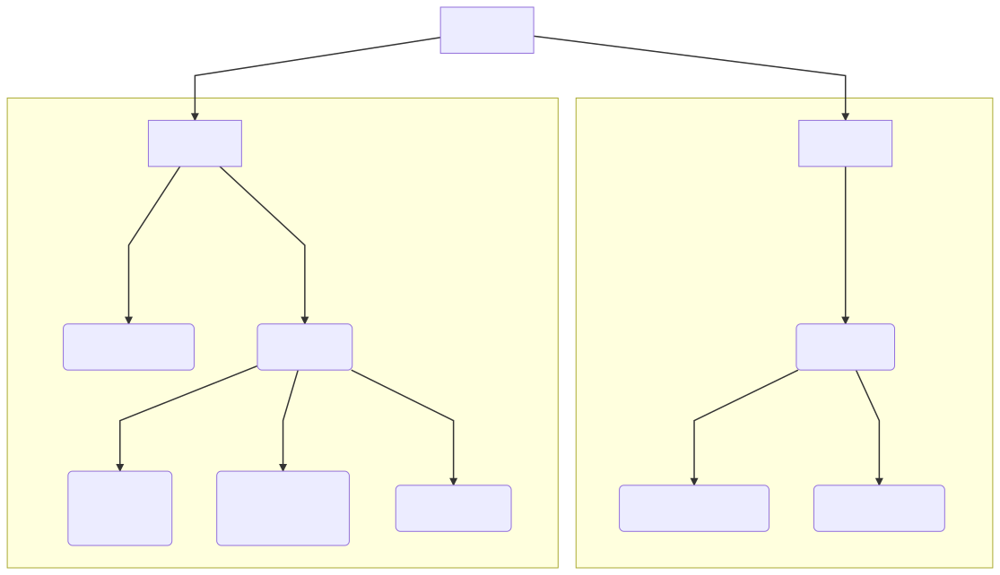

> 编译原理期末考试复习，于 2019-1-15

# REVIEW

```mermaid
graph TB;

TOPIC[语法分析];
TOPIC-->M1; TOPIC-->M2;
subgraph 自上而下
	M1[自上而下]; WF1("LL(1)文法"); WF11(递归下降分析器); WF12(预测分析程序);
	
	M1-->|1.不含左递归<br>2.非终结符 FIRST 集不相交<br>3.一个关于epsilon时的约束|WF1
	WF1-->|一个非终结符<br>对应一个子程序|WF11;
	WF1-->|构造预测分析表|WF12
end
subgraph 自下而上
	M2[自下而上]; WF2(算符优先文法); WF3("LR分析法"); WF31("SLR分析法<br>LR(0)项目"); WF32("规范LR分析法<br>LR(1)项目"); WF33("LALR分析法")
	
	M2-->|"1.算符文法:<br>不含两个相继的非终结符<br>2.算符优先文法:<br>算符间关系是唯一的"|WF2
	M2-->|状态<br>ACTION 子表<br>GOTO 子表|WF3
	WF3-->|1.无移进规约冲突<br>2.不含多个规约项|WF31
	WF3-->|"通过多读一个词<br>解决LR(0)冲突"|WF32
	WF3-->|"合并LR(1)项目同心集"|WF33
end
```

