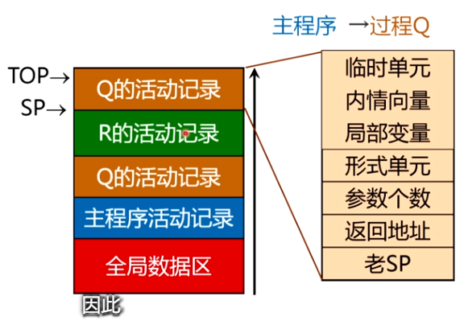

> 学习途径：
>
> - 国防科技大学中国大学 MOOC

# 运行时存储空间组织

## 参数传递

参数传递主要有四种传递方式：

- 传地址；
- 得结果：传地址的变形。
  - 每个形参对应两个形式单元：第一个存放实参地址；第二个存放值。
  - 在过程体中的任何引用或赋值都看作对它的第二个单元的直接访问。
  - 过程完成返回之前，把第二个单元的值存放到第一的单元所指向中。
- 传值；
- 传名：不常见。
  - 在进入被调用过程之前不对实在参数预先进行计值，而是让过程提中每当使用到相应的形式参数时才祝词对它实行计值（或计算地址）。
  - 通常把实在参数处理成一个子程序（称为参数子程序），每当过程体中使用到相应的形式参数时就调用这个子程序。

## 运行时存储器的划分

一个目标程序运行时所需的存储空间包括：

- 存储目标代码的空间 $$\Rightarrow$$ 算法
- 存放数据项目的空间 $$\Rightarrow$$ 数据结构

- 存放程序运行的控制或连接数据所需要的单元

编译程序组织存储空间须考虑的问题：

- 过程是否允许递归？
- 当控制从一个过程的活动返回时，对局部名称的值如何处理？
- 过程是否允许引用非局部名称？
- 过程调用时如何传递参数？“过程”是否可以做为参数被传递和作为结果返回？
- 存储空间可否在程序控制下进行动态分配？
- 存储空间是否必须显式地释放？

## 存储分配策略

主要有两种分配策略：

- 静态分配策略：在编译时能确定数据空间的大小，并且为每个数据项目确定出在运行时刻的存储空间中的位置。比如：FORTRAN 语言。

- 动态分配策略：在编译时不能确定运行时数据空间的大小，允许递归过程和动态申请释放内存。

  - 栈式动态分配、堆式动态分配。

  - 函数调用使用栈式分配策略，变量空间使用堆式动态分配。

### 非嵌套过程语言

特点：

- 允许过程递归调用、可以允许可变数组
- 过程定义不允许嵌套（即 不可以在函数内部定义函数）
- 比如：C 语言。

其过程管理通过栈式管理，一个程序中，按以下方式调用 `main -> Q -> R -> Q`，则其运行栈结构大致如下：



过程调用和过程返回：

- 过程调用的语句 `P(T1, T2, ..., Tn)`，翻译称下面的代码序列：

  ```pseudocode
  par T1
  par T2
  ...
  par Tn
  call P, n
  ```

- 过程调用的**目标代码**通过以下的方式生成：

  - 每个 `par Ti` 可以翻译成如下的指令：

    ```pseudocode
    # 传值方式翻译
    (i+3)[TOP] := Ti
    
    # 传地址方式翻译
    (i+3)[TOP] := addr(Ti)
    ```

  - 对于 `call P, n` 则翻译成以下的指令

    ```pseudocode
    1[TOP] := SP
    3[TOP] := n
    JSR P			# 跳转指令
    ```

  - 转进过程 P 后，首先执行下述指令

    ```pseudocode
    SP := TOP + 1
    1[SP] := 返回地址
    TOP := TOP + L
    ```

    其中，L 为过程 P 的火丁记录所需要的单元数，在编译时可确定。

- 过程返回时，应执行下面的指令：

  ```pseudocode
  TOP := SP - 1
  SP := 0[SP]
  X := 2[TOP]
  UJ 0[X]
  ```

### 嵌套过程语言

特点：

- 允许过程递归调用、也可以允许可变数组
- 过程定义允许嵌套
- 比如：PASCAL 语言

因为程序运行时，过程可以访问外层过程的变量。程序运行时，必须能知道它所有外层过程的当前活动记录的起始地址。


非局部名字的访问的实现：

- 静态链的活动记录
- 嵌套层次显示表 DIsplay

#### 静态链表方法

嵌套层次：

- 主程序的层次为 0
- 在第 `i` 层中定义的过程，其层次为 `i+1`


每一个局部变量用一个 `嵌套层数 + 地址偏移量` 的二元组唯一确定。并增加以下两个变量：

- **动态链**：指向本过程的调用过程的活动记录的起始地址，也称控制链。

- **静态链**：指向本过程的直接外层过程的活动记录起始地址，也称存取链。

 