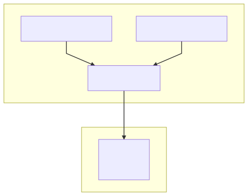

# Windows 操作系统

## WinAPI 简介

API 函数是构筑整个 Windows 框架的基石，在它的下面是 Windows 的操作系统的核心，而它的上面则是 Windows 应用程序：



- 用于 16 版本的 Windows 的 API（Windows 1.0 到 Windows 3.1）现在称作 Win16。
- 用于 32 版本的 Windows 的 API（Windows 9x/NT/2000/XP/2003）现在称作 Win32。


Windows 运转的核心是一个叫做 “动态链接” 的概念，Windows 提供了应用程序可以用的丰富的函数调用，这些函数采用动态链接库即 DLL 实现。

- 在 Windows 9x 中通常位于 `/WINDOWS/SYSTEM` 子目录中；
- 在 Windows NT/2000/XP 中通常位于 `/SYSTEM/SYSTEM32` 子目录中。


在早期，Windows 的主要部分只需要在三个动态链接库中实现。这代表了 Windows 的三个主要的子系统，分别叫 Kernel、User 和 GDI：

- `Kernel`（由 16 位的 `KRNL386.EXE` 和 32 位的 `KERNEL32.DLL` 实现）：操作系统核心功能服务，包括进程与线程控制、内存管理、文件访问等；
- `User`（由 16 位的 `USER.EXE` 和 32 位的 `USER32.DLL` 实现）：负责处理用户接口，包括键盘和鼠标输入、窗口和菜单管理等；
- `GDI`（由 16 位的 `GDI.EXE` 和 32 位的 `GDI32.DLL` 实现）：图形设备接口，允许程序在屏幕和打印机上显示文本和图形。

- 除此上述模块之外，Windows 还提供了其他一些 DLL 以支持另外一些功能，包括对象安全性、注册表操作（`ADVAPI32.DLL`）、通用控件（`COMCTL32.DLL`）、公共对话框（`COMDLG32.DLL`）、用户界面外壳（`SHELL32.DLL`）、图形引擎（`DIBENG.DLL`）、以及网络（`NETAPI32.DLL`）。

Win 32 API 是一个基于 C 语言的接口，但是 Win32 API 中的函数可以由不同语言编写的程序调用。

## 常用的 Win32 API 函数

API 函数的官方文档可以在 MS 提供的[网站](https://docs.microsoft.com/en-us/windows/desktop/api/winuser/)上找到。

API 函数是区分字符集的：A 表示 ANSI，W 表示 Widechars（即 Unicode）。前者使用单字节方式，后者是宽字节方式处理。

- 例如：在编程时使用 `MessageBox` 函数，在 `USER32.DLL` 中有两个入口点：`MessageBoxA` 和 `MessageBoxW`。而程序员不必关心这个问题，代码中只需要使用 `MessageBox`，开发工具中的编译模块就会根据设置决定采用哪一个。

以下为常用 API 函数详解：

### `hmemcpy` 函数

函数原型：

```c
void hmemcpy(
    void _huge *hpvDest,			// 目的数据地址
    const void _huge *hpvSource,	// 源数据地址
    long cbCopyn					// 数据大小（字节）
);
```

这是一个 Win16 的 API 函数，位于 16 位的 `KRNL386.EXE` 链接库中，该函数执行的操作很简单，只是将内存中的一块数据拷贝到另一块。

Windows 9x 底层频繁地调用 `hmemcpy` 这个 16 位的函数来拷贝数据。由于这个特性，它常被解密者作为断点拦截数据，从而有个别称 “万能断点”。

### `GetWindowText` 函数

此函数在 `USER32.DLL` 用户模块中，它的作用是取得一个窗口的标题文字，或者一个文本控件的内容，函数原型为：

```c
int GetWindowText( // RETURN：如果成功就返回文本长度，失败则返回零值
    HWND hWnd,			// 窗口或文本控件句柄
    LPTSTR lpString,	// 缓冲区地址
    int nMaxCount		// 复制的最大字符数
);
```

ANSI 版是 `GetWindowTextA`，Unicode 版是 `GetWindowTextW`

### `GetDlgItem` 函数

此函数在 `USER32.DLL` 用户模块中，作用是获取指定对话框的句柄，函数原型为：

```c
HWND GetDlgItem( // RETURN：成功返回对话框句柄，失败则返回零
    HWND hDlg,		// 对话框句柄
    int nIDDlgItem	// 控件标识
);
```

### `GetDlgItemText` 函数

此函数在 `USER32.DLL` 用户模块中，作用是获取对话框文本，函数原型为：

```c
UINT GetDlgItemText( // RETURN：成功返回文本长度，失败则返回零
    HWND hDlg,			// 对话框句柄
    int nIDDlgItem,		// 控件标识（ID号）
    LPTSTR lpString,	// 文本缓冲区指针
    int nMaxCount		// 字符缓冲区长度
);
```

ANSI 版是 `GetDlgItemTextA`，Unicode 版是 `GetDlgItemTextW`

### `GetDlgItemInt` 函数

此函数在 `USER32.DLL` 用户模块中，将对话框内的文本翻译为一个整数值，其函数原型如下：

```c
UINT GetDlgItemInt(
  HWND hDlg,			// 对话框句柄
  int  nIDDlgItem,		// 控件标识
  BOOL *lpTranslated,	// 接收成功/失败指示的指针
  BOOL bSigned			// 指定有符号数还是无符号数
);
```

- 成功返回文本对应的整数值，`lpTranslated` 被置位 `TRUE`
- 失败返回零，`lpTranslated` 被置位 `FALSE`

### `MessageBox` 函数

此函数在 `USER32.DLL` 用户模块中，用于创建和显示消息框。函数原型：

```c
int MessageBox(
    HWND hWnd,			// 父窗口句柄
    LPCTSTR lpText,		// 消息框我文本地址
    LPCTSTR lpCation,	// 消息框标题地址
    UINT uType			// 消息框样式
);
```

## 什么是句柄

Windows 的标识，由应用程序建立或使用的对象所使用的唯一的整数值（通常 32 位）。句柄的实际值对应用程序无关紧要，这个值是被 Windows 模块内部来引用相应对象的。当一个进程被初始化，系统要为它分配一个句柄表，句柄值是放入进程的句柄表中的索引。

## Windows 消息机制

Windows 是一个**消息驱动系统**，Windows 消息提供应用程序与应用程序之间、应用程序与 Windows 系统之间进行通信的手段。应用程序想要实现的功能由消息来触发，并靠消息的相应和处理来完成。

Windows 有两种消息队列：系统消息队列，应用程序消息队列。计算机所有输入设备由 Windows 监控。当一个事件发生时：

1. Windows 先将输入的消息放入系统消息队列中
2. 再将输入的消息拷贝到相应的应用程序队列中
3. 应用程序中的消息循环程序 从它的消息队列中检索每个消息并且发送给相应的窗口函数中。

*NOTICE*：消息非抢先性，不论事件缓急，总是进入 FIFO 队列。

### `SendMessage` 函数

调用一个窗口的窗口函数，将一个消息发给那个窗口。除非消息已经处理完毕，否则函数不会返回：

```c
LRESULT SendMessage( // RETURN：如果消息投递成功，则返回 TRUE
    HWND hWnd,			// 目的消息窗口的句柄
    UINT Msg,			// 消息的标识符
    WPARAM wParam,		// 消息的 WPARAM 域
    LPARAM lParam		// 消息的 LPARAM 域
);
```

### `WM_COMMAND` 消息

