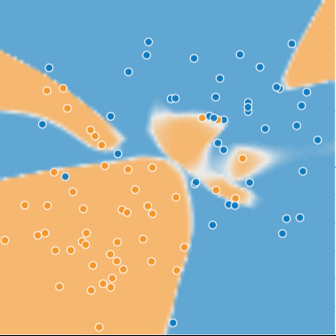

# 泛化

## 过拟合

下图所示的模型**过拟合**了训练数据的特性。过拟合模型在训练过程中产生的损失很低，但在预测新数据方面的表现却非常糟糕。如果某个模型在拟合当前样本方面表现良好，那么我们如何相信该模型会对新数据做出良好的预测呢？正如您[稍后](https://developers.google.cn/machine-learning/crash-course/regularization-for-simplicity/l2-regularization)将看到的，过拟合是由于模型的复杂程度超出所需程度而造成的。机器学习的基本冲突是适当拟合我们的数据，但也要尽可能简单地拟合数据。

机器学习的目标是对从真实概率分布（已隐藏）中抽取的新数据做出良好预测。遗憾的是，模型无法查看整体情况；模型只能从训练数据集中取样。如果某个模型在拟合当前样本方面表现良好，那么您如何相信该模型也会对从未见过的样本做出良好预测呢？

奥卡姆的威廉是 14 世纪一位崇尚简单的修士和哲学家。他认为科学家应该优先采用更简单（而非更复杂）的公式或理论。奥卡姆剃刀定律在机器学习方面的运用如下：

> 机器学习模型越简单，良好的实证结果就越有可能不仅仅基于样本的特性。

现今，我们已将奥卡姆剃刀定律正式应用于**统计学习理论**和**计算学习理论**领域。这些领域已经形成了**泛化边界**，即统计化描述模型根据以下因素泛化到新数据的能力：

- 模型的复杂程度
- 模型在处理训练数据方面的表现

虽然理论分析在理想化假设下可提供正式保证，但在实践中却很难应用。机器学习速成课程则侧重于实证评估，以评判模型泛化到新数据的能力。

机器学习模型旨在根据以前未见过的新数据做出良好预测。但是，如果您要根据数据集构建模型，如何获得以前未见过的数据呢？一种方法是将您的数据集分成两个子集：

- **训练集** - 用于训练模型的子集。
- **测试集** - 用于测试模型的子集。

一般来说，在测试集上表现是否良好是衡量能否在新数据上表现良好的有用指标，前提是：

- 测试集足够大。
- 您不会反复使用相同的测试集来作假。

## 机器学习细则

以下三项基本假设阐明了泛化：

- 我们从分布中随机抽取**独立同分布** (**i.i.d**) 的样本。换言之，样本之间不会互相影响。（另一种解释：i.i.d. 是表示变量随机性的一种方式）。
- 分布是**平稳的**；即分布在数据集内不会发生变化。
- 我们从**同一分布**的数据划分中抽取样本。

在实践中，我们有时会违背这些假设。例如：

- 想象有一个选择要展示的广告的模型。如果该模型在某种程度上根据用户以前看过的广告选择广告，则会违背 i.i.d. 假设。
- 想象有一个包含一年零售信息的数据集。用户的购买行为会出现季节性变化，这会违反平稳性。

如果违背了上述三项基本假设中的任何一项，那么我们就必须密切注意指标。

## 关键字词

[泛化](https://developers.google.cn/machine-learning/crash-course/glossary#generalization)、[过拟合](https://developers.google.cn/machine-learning/crash-course/glossary#overfitting)、[预测](https://developers.google.cn/machine-learning/crash-course/glossary#prediction)、 [平稳性](https://developers.google.cn/machine-learning/crash-course/glossary#stationarity)、[测试集](https://developers.google.cn/machine-learning/crash-course/glossary#test_set)、[训练集](https://developers.google.cn/machine-learning/crash-course/glossary#training_set)

