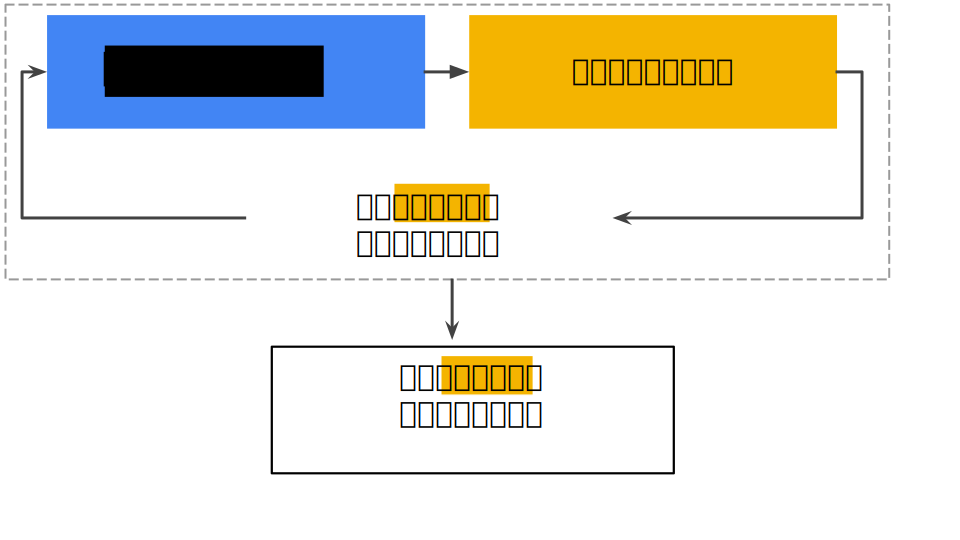
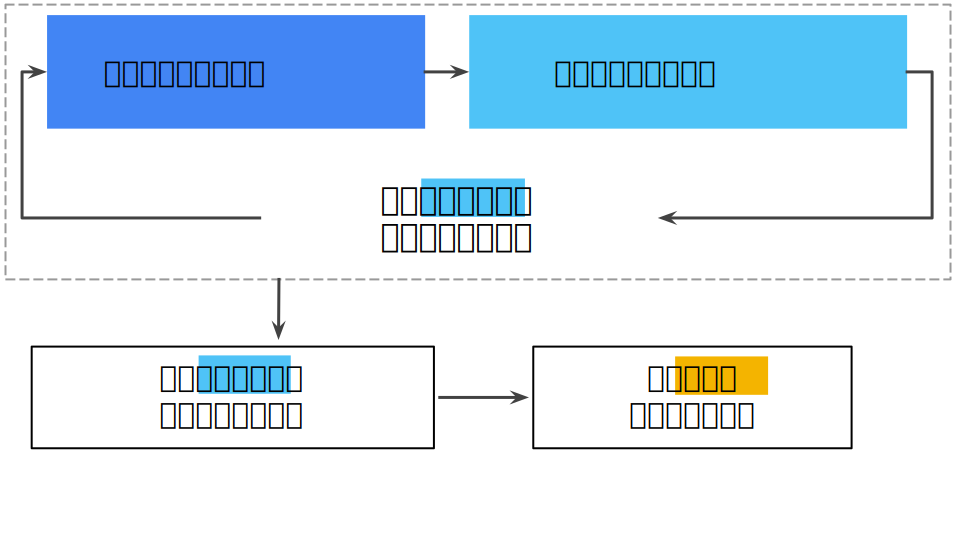

# 验证集

[上一单元](https://developers.google.cn/machine-learning/crash-course/training-and-test-sets/video-lecture)介绍了如何将数据集划分为训练集和测试集。借助这种划分，您可以对一个样本集进行训练，然后使用不同的样本集测试模型。采用两种分类之后，工作流程可能如下所示：

将数据集划分为两个子集是个不错的想法，但不是万能良方。通过将数据集划分为三个子集（如下图所示），您可以大幅降低过拟合的发生几率：

使用**验证集**评估训练集的效果。然后，在模型“通过”验证集之后，使用测试集再次检查评估结果。下图展示了这一新工作流程：

在这一经过改进的工作流程中：

1. 选择在验证集上获得最佳效果的模型。
2. 使用测试集再次检查该模型。

该工作流程之所以更好，原因在于它暴露给测试集的信息更少。

